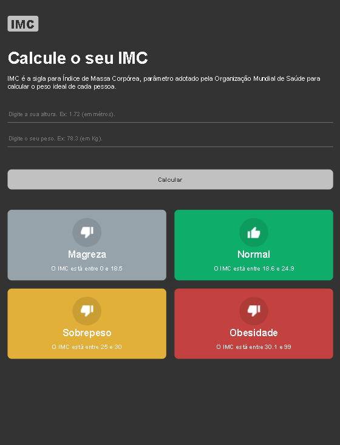

# Calculadora de IMC

Projeto desenvolvido utilizando React + Typescript durante o curso [B7Web](https://b7web.com.br/fullstack).

### Instalar:

- `npm install`

### Rodar:

- `npm start`

#

## PC:

## Tablet:

## Smartphone:

